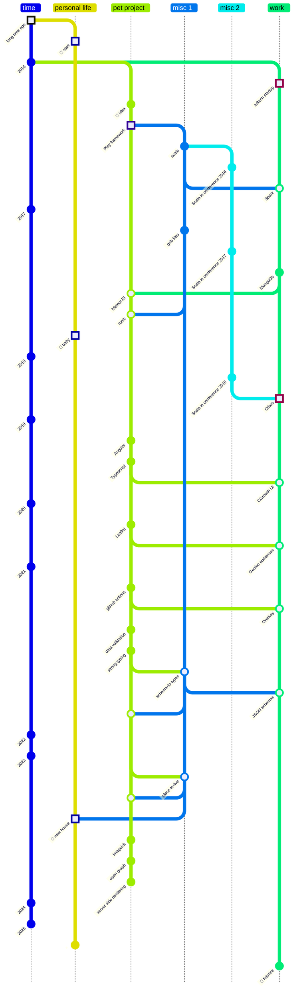

%% Presentation

```mermaid
---
config:
  gitGraph:
    mainBranchName: "time"
    parallelCommits: false
---
gitGraph TB: %%LR:
    checkout "time"
    commit id:"long time ago" type:HIGHLIGHT

    branch "personal life"
    checkout "personal life"
    commit id:"👶 start" type:HIGHLIGHT

    %% ------------------------------- 2016
    checkout "time"
    commit id:"2016"
    %% ------------------------------------

    checkout "time"
    branch "work" order:5
    checkout "work"
    commit id:"adtech startup" type:HIGHLIGHT

    %% ------------- Start pet project
    checkout "time"
    branch "pet project"  order:2
    checkout "pet project"
    commit id:"🤙 idea"
    commit id:"Play framework" type:HIGHLIGHT
    %% ------------------------------------

    branch "misc 1" order:3
    checkout "misc 1"
    commit id:"scala"
    
    branch "misc 2" order:4

    %% --------------------------- Scala.io
    checkout "misc 2"
    commit id:"Scala.io conference 2016"
    %% ------------------------------------
    
    %% ------------------------------- Spark
    checkout "work"
    merge "misc 1" id:"Spark"
    %% -------------------------------------

    %% ------------------------------- 2017
    checkout "time"
    commit id:"2017"
    %% ------------------------------------
    
    checkout "misc 1"
    commit id:".grib files"

    %% --------------------------- Scala.io
    checkout "misc 2"
    commit id:"Scala.io conference  2017"
    %% ------------------------------------
    
    checkout "work"
    commit id:"MongoDb"
    
    checkout "pet project"
    merge "work" id:"MeteorJS"
    
    merge "misc 1" id:"Ionic"
    
    %% ------------------------------- Baby
    checkout "personal life"
    commit id:"👶 baby" type:HIGHLIGHT
    %% ------------------------------------

    %% ------------------------------- 2018
    checkout "time"
    commit id:"2018"
    %% ------------------------------------

    %% --------------------------- Scala.io
    checkout "misc 2"
    commit id:"Scala.io conference  2018"
    %% ------------------------------------
    
    %% ---------------------------- Start Criteo
    checkout "work"
    merge "misc 2" id:"Criteo" type:HIGHLIGHT
    
    %% ------------------------------- 2019
    checkout "time"
    commit id:"2019"
    %% ------------------------------------

    checkout "pet project"
    commit id:"Angular"
    commit id:"Typescript"

    checkout "work"
    merge "pet project" id:"CGrowth UI"

    %% ------------------------------- 2020
    checkout "time"
    commit id:"2020"
    %% ------------------------------------
    
    checkout "pet project"
    commit id:"Leaflet"
    
    checkout "work"
    merge "pet project" id:"Geoloc audiences"

    %% ------------------------------- 2021
    checkout "time"
    commit id:"2021"
    %% ------------------------------------

    checkout "pet project"
    commit id:"github actions"
    
    checkout "work"
    merge "pet project" id:"OneKey"


    checkout "pet project"
    commit id:"data validation"
    commit id:"strong typing"


    checkout "misc 1"
    merge "pet project" id:"schema-to-types"

    checkout "work"
    merge "misc 1" id:"JSON schemas"
    
    checkout "pet project"
    merge "misc 1"

    %% ------------------------------- 2022
    checkout "time"
    commit id:"2022"
    %% ------------------------------------

    %% ------------------------------- 2023
    checkout "time"
    commit id:"2023"
    %% ------------------------------------

    %% ---------------------- Place to live
    checkout "misc 1"
    merge "pet project" id:"place-to-live"
    checkout "pet project"
    merge "misc 1"
    %% ------------------------------------

    checkout "personal life"
    merge "misc 1" id:"🏡 new house" type:HIGHLIGHT

    checkout "pet project"
    commit id:"ImageKit"

    checkout "pet project"
    commit id:"open graph"

    checkout "pet project"
    commit id:"server side rendering"

    %% ------------------------------- 2024
    checkout "time"
    commit id:"2024"
    %% ------------------------------------

    %% ------------------------------- 2025
    checkout "time"
    commit id:"2025"
    %% ------------------------------------
    
    checkout "personal life"
    commit id:" "

    checkout "work"
    commit id:"🎤 futurise"
    
```